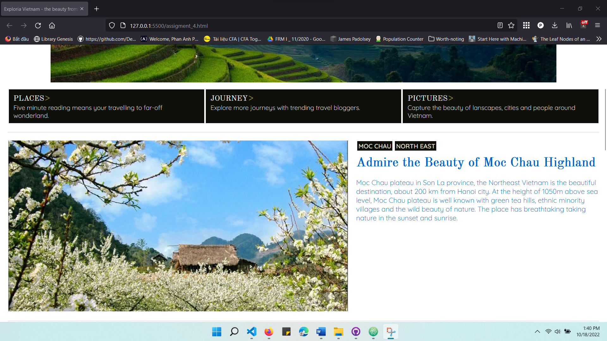
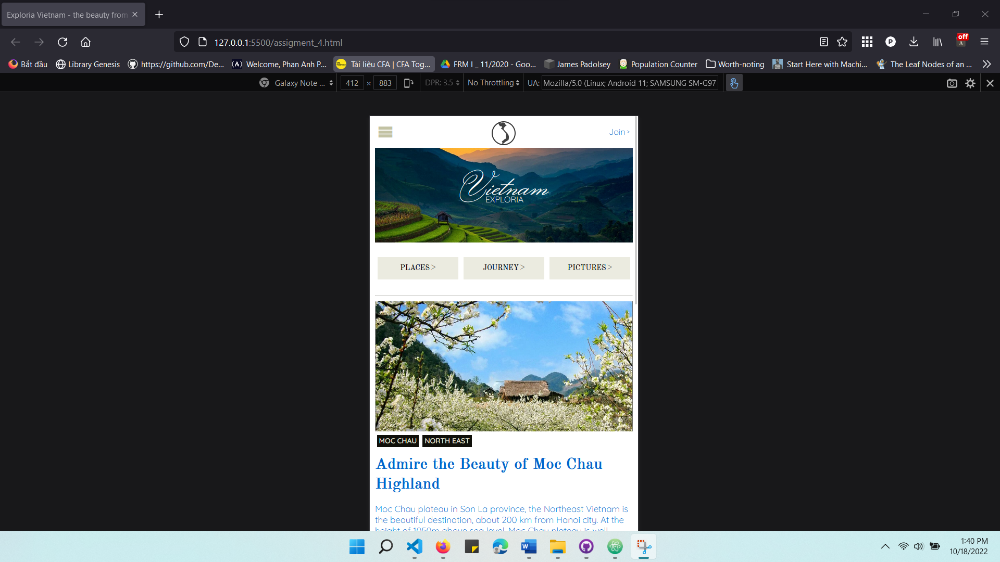
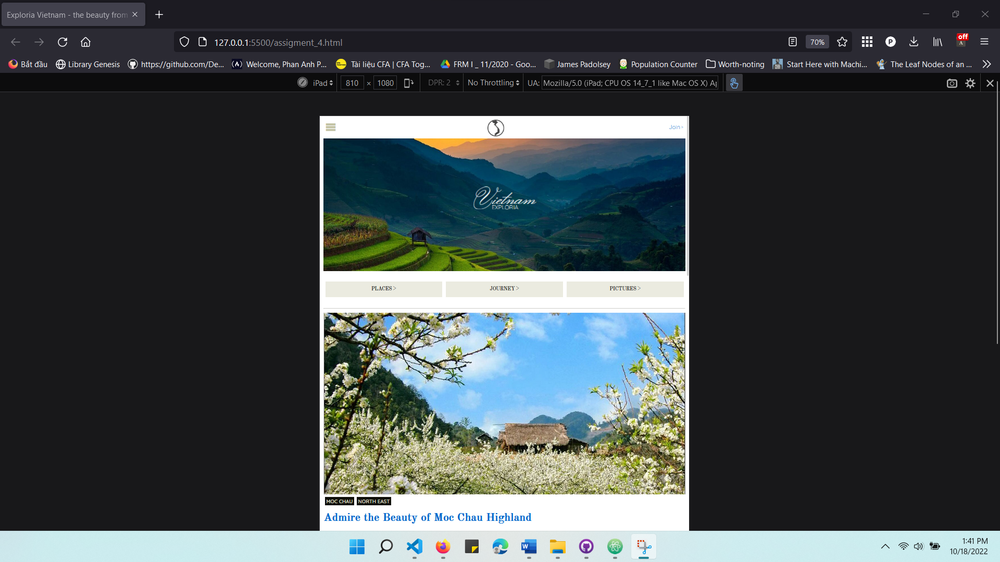

# web101x_02_vn-html-css-tourism-page

 This folder contains my submission to the assignment Build a plain website with HTML and CSS to introduce local tourism in the course WEB101x_02_VN (Build the first website), a part of the path Software Engineering provided by FUNiX.

## About the project

- The project includes pages introducing the tourist attractions in Vietnam such as Moc Chau Highland, Quy Nhon, Hoi An, Sai Gon. All pages are coded and styled in plain HTML and CSS with responsiveness.
- **Keyword**: _HTML, CSS, responsive design_

## Functional description
Pages are:
- Main page: from this page will redirect to others pages
- Moc Chau Highland
- Quy Nhon
- Hoi An
- Sai Gon

_**Notes:**_ pages must be responsive when changing viewport, for example:

|    |      |     |
| :------------- | :------------- | :------------- |

## Demo

Part 1 can be accessed from: <a href="Part1_DBI202x_ASM1_phupaFX07929.pdf" target="_blank">Part 1 - _Analyse and design database model_</a>

Part 2 can be accessed from: <a href="Part2_DBI202x_ASM2_phupaFX07929\DBI202x_ASM2_phupaFX07929.pdf">Part 2 - _Implement database design with Microsoft SQL Server_</a>

## Further enhancement
- Add an English version of files
- Crawl data and inspect real online newspaper websites for better entity design
